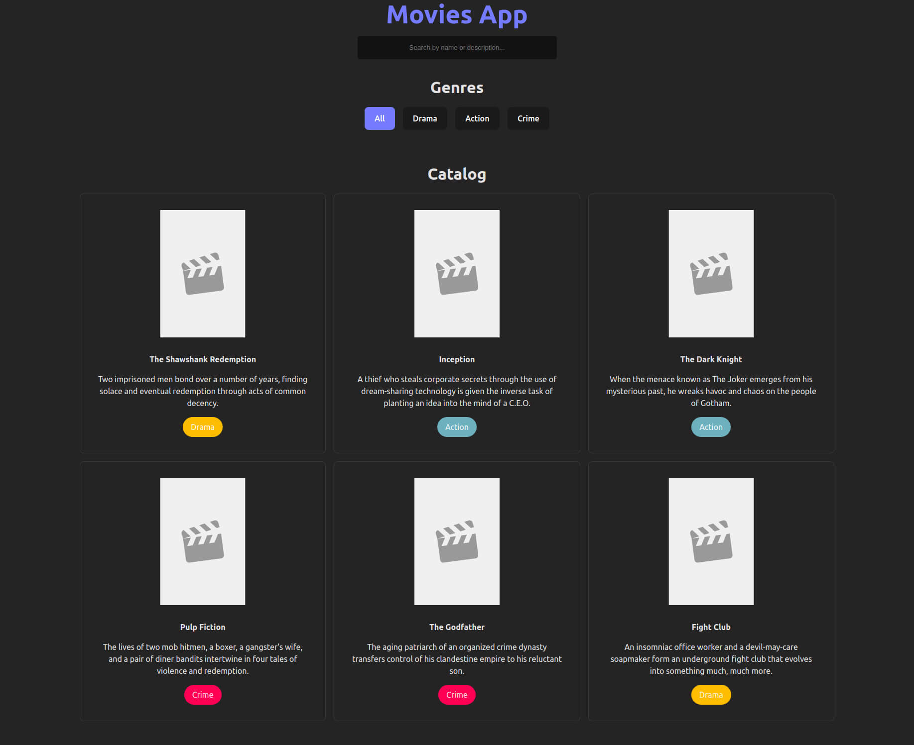

# Movie App

Welcome to Movie App! This simple web application allows you to browse movies by genre, search for movies by name or description, and discover your next favorite film.

## Features

- Filter movies by genre
- Search movies by name or description
- Dynamic routing with React Router DOM
- Efficient state management with React hooks
- Responsive design with SCSS

## Built With

- React
- Vite
- React Router DOM
- Axios
- SCSS

## Hooks Used

- useCallback
- useMemo
- useState
- useEffect
- useContext

## Authors

👤 **Author1**

- Github: [jorgearteagar3](https://github.com/JorgeArteagaR3)
- Linkedin: [linkedin](https://www.linkedin.com/in/jorgeaaranibar/)

## Getting started

- Clone the repository with:
  `git clone git@github.com:JorgeArteagaR3/delfosty-test.git`

- Install dependencies: `npm install`

- Start the development server: `npm run dev`

## 🤝 Contributing

Contributions, issues and feature requests are welcome!

Feel free to check the [issues page](issues/).

## Show your support

Give a ⭐️ if you like this project!
